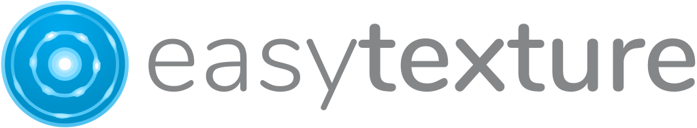

**EasyTexture** is planned as software for the reduction of powder diffraction data from textured materials.

We are currently working on a prototype of graphical user interface for **EasyTexture**, which will be based on the **EasyScience** framework.

### Contributing

We absolutely welcome contributions. Currently, **EasyTexture** is a collaborative project between the Department of Structural Geology and Geodynamics of Georg August University of Göttingen, Germany and European Spallation Source ERIC, Sweden.
